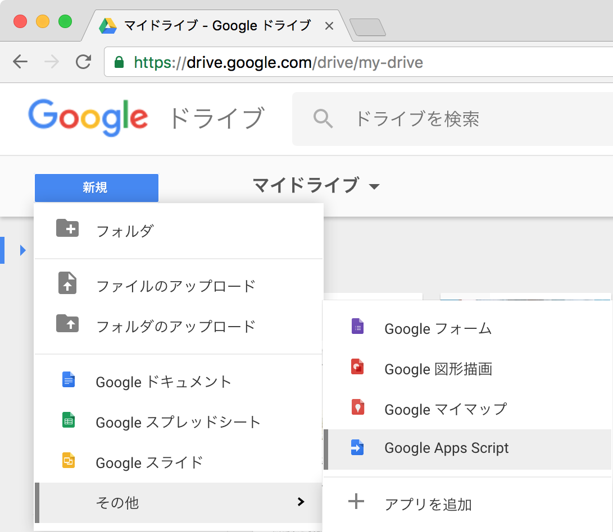
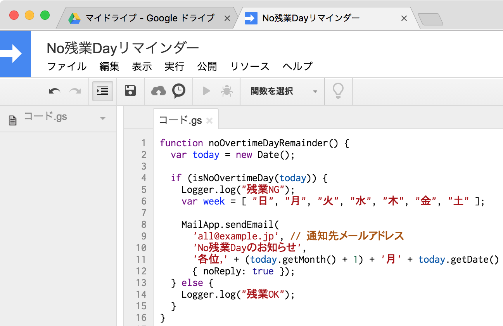
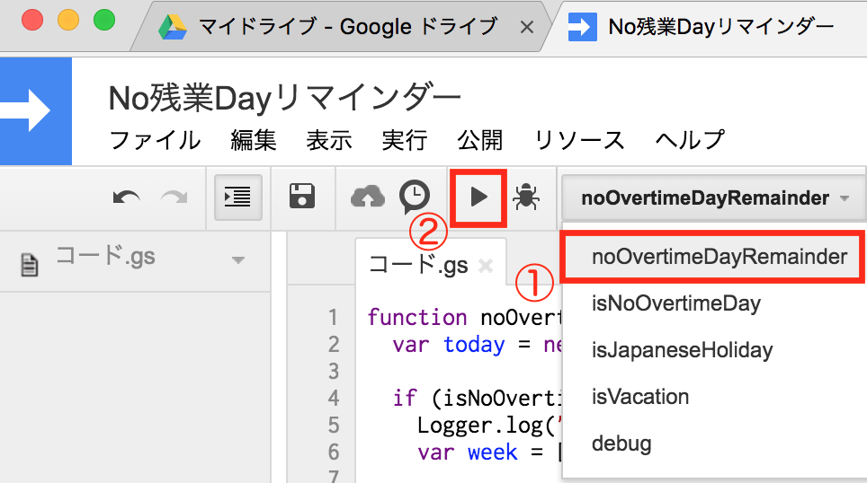
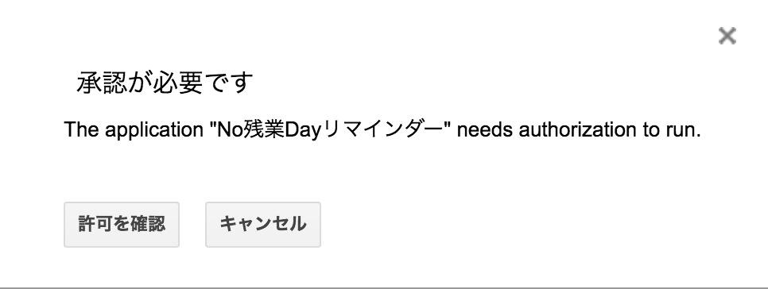
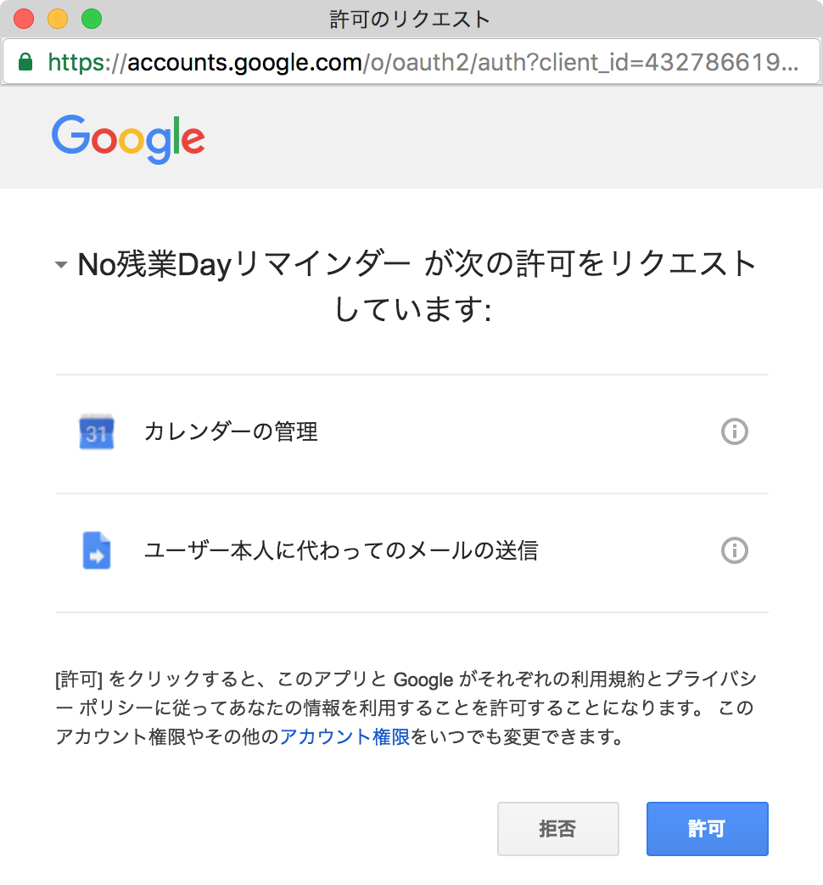
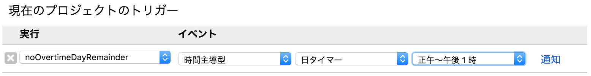

NoOvertimeDayReminder
=====================
No残業Dayリマインダー

概要
----
+ 任意の曜日にNo残業Dayの通知をメールで送ります。
+ 指定出来るのは毎週○曜日もしくは第N週△曜日という具合です。
+ デフォルト値は毎週水曜日と第4週金曜日としています。（カスタマイズ可能）
+ 日本の祝日の他，夏休み・冬休み・創立記念日などは除外できます。（カスタマイズ可能）

手順
----
+ Googleドライブにて新規Google Apps Scriptを開く

+ スクリプトスクリプト（NoOvertimeDayRemainder.gs）をコピペし通知先メールアドレス（Googleグループ等のMLが望ましい），No残業Day（noOvertimeDays）と休暇日（vacation）を調整し保存する

+ NoOvertimeDayRemainderを指定してテスト実行

+ 起動を承認する

+ APIの利用を許可する

+ トリガー設定（実行:noOvertimeDayRemainder, イベント:時間主導型, 日タイマー, 正午〜午後1時）

+ できあがり

お試しあれ！
----------
ただし無保証
